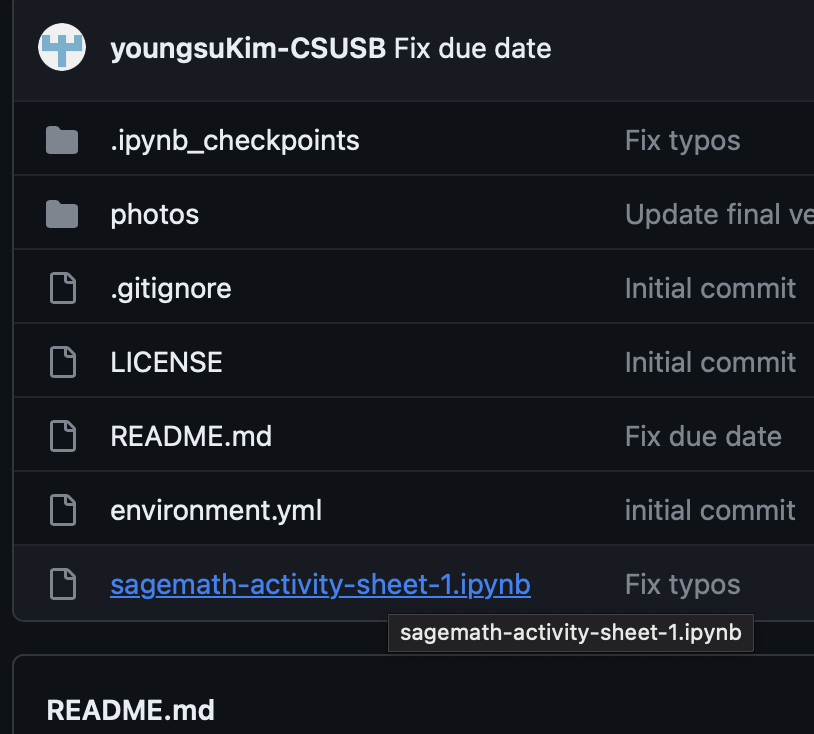
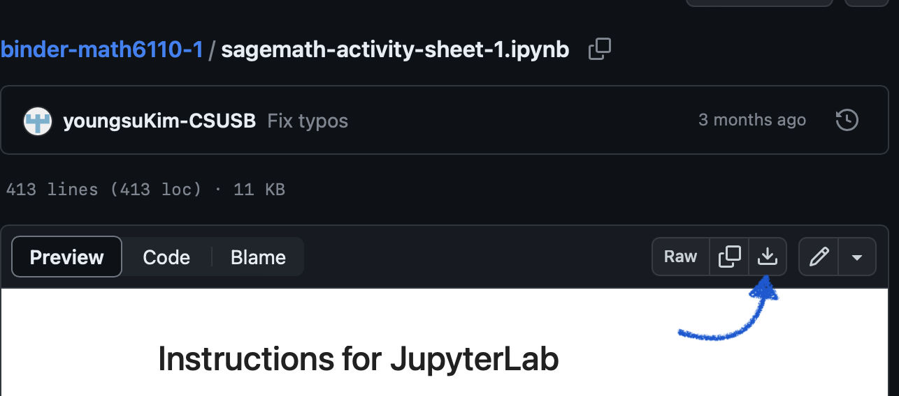

Asynchronous activity sheet 
---
Due by Thursday, May 11th, 11:59 pm

There are a few ways you run ``SageMath`` on ``JupyterLab``.

* Download the ``sagemath-activity-sheet-2.ipynb`` file to your computer and work locally. This only works if you have SageMath installed on your local machine; see below how to download a file. 
* Use the school server, https://csusb-jupyter.nrp-nautilus.io/. You still need to download and upload the ``sagemath-activity-sheet-2.ipynb`` file. 
* Use . To launch it, click on the ``launch binder`` icon. no installation is necessary but it may take a while to load. 
    > **Wanrning:** No work will be saved once you lose your connection to the Binder server. If you are inactive for some minutes (I guess around 10 minutes), you will lose your connection meaning your work. 

<!-- https://mybinder.org/v2/gh/youngsuKim-CSUSB/binder-math6110-1/2nd-exercise -->

When done you will need to save your notebook and upload it to [Canvas](https://csusb.instructure.com/courses/24717/assignments/385953). 

For a brief introduction to JupyterLab, https://www.youtube.com/watch?v=-UwAsLtl8nQ, https://www.youtube.com/watch?v=5pf0_bpNbkw, or Google for more information as needed. 

### How to download ipynb file

1. Click on the name of the file you want to download.

2. Click on the download icon

